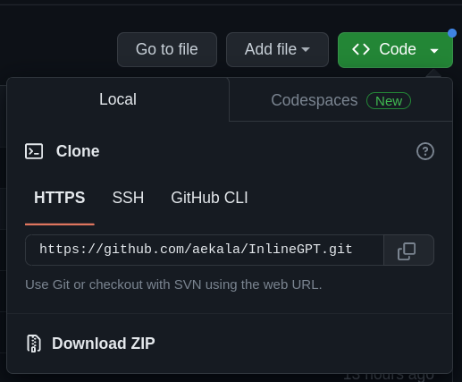
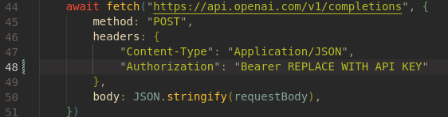
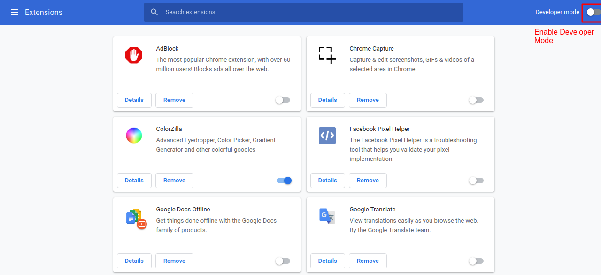
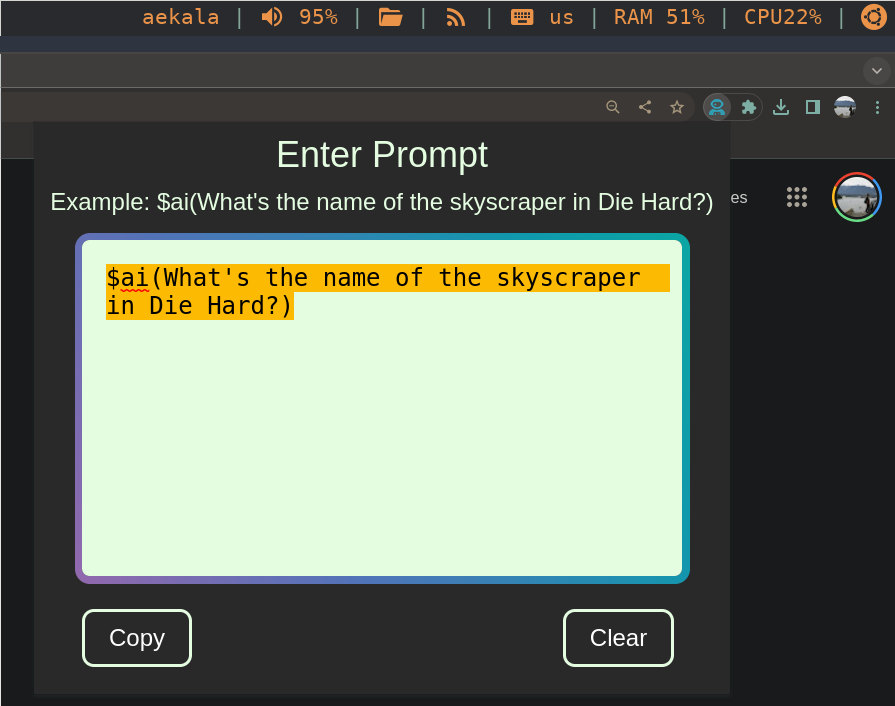
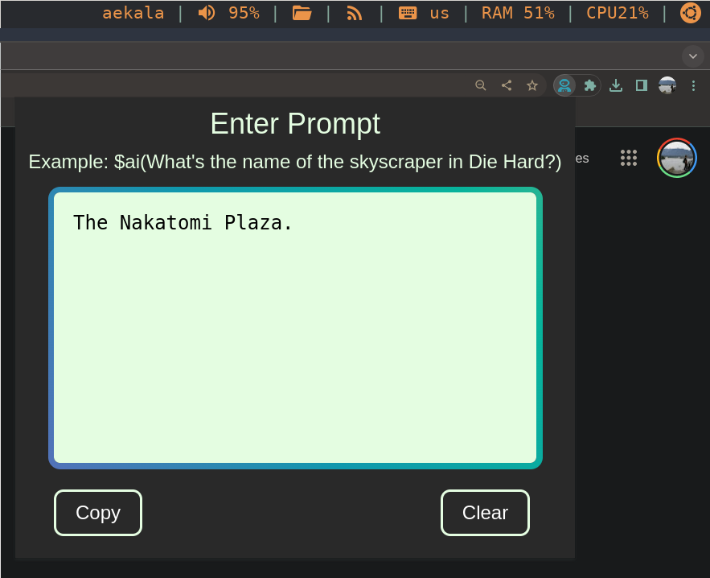

#   InlineGPT
InlineGPT is a Google Chrome extension for querying OpenAI's ChatGPT text completion API inside of a Chrome extension popup. 
<br>
Per OpenAI, the completions endpoint can be used for a wide variety of tasks. It provides a simple but powerful interface to any of our models. You input some text as a prompt, and the model will generate a text completion that attempts to match whatever context or pattern you gave it. For example, if you give the API the prompt, "As Descartes said, I think, therefore", it will return the completion " I am" with high probability.

The name InlineGPT is because I initially was going to make an extension to call ChatGPT inline from any input or textarea HTML element in the browser. I did get the code for that working but found that for a lot of sites I wanted to use it for like Facebook Messenger and Twitter dynamically generate a span element in the DOM for input instead of using input or textarea for their input fields. The first problem this created was that grabbing that specific span element would be difficult as it did not have a static id I could use to locate it within the DOM. Another problem was that an input event is only fired when the value of an <input>, <select>, or <textarea> element has been changed, meaning that I would not be able to attach such an event listener to the span element where I to find a way to grab it from the DOM. I'm sure there are workarounds for both of these but I was planning on adding a popup to use call ChatGPT anyway and didn't want to spend too much time on this project. 

# Setup

## 1) Download
In order to use this Google Chrome extension, you'll need to download the project onto your computer by downloading the .zip file  and then extracting it to a folder.
<br>



Or if you have git installed on your computer, you can clone the repository by opening a terminal window, navigating to the folder you want to download the project to and using the following command:

<br>

```bash
git clone https://github.com/aekala/InlineGPT.git
```

## 2) Create an OpenAI Account 
You'll need to create an OpenAI account to get your own API key that will allow you query ChatGPT. The free tier provides $5 worth of queries and you don't have to provide any payment info, so don't worry about getting charged if you hit the free tier limit. This step is also to not expose my own secret key and allow users to use up my own free tier :)
<br> 

Go to https://platform.openai.com/ where you can create an account or login if you already have one.
Then navigate to https://platform.openai.com/docs/quickstart/add-your-api-key, and click on the button to create a new secret key.
<br>
<br>


Copy the generated API key and replace the "REPLACE WITH API KEY" section within the InlineGPT/script.js file on line 48. This file will be inside of the folder you extracted from the .zip file or cloned using git. 
<br>
Make sure not to delete the "Bearer" part of the line. 



## 3) Load Extension to Google Chrome
Before you can load this extension into Google Chrome, you'll have to enable "Developer mode" by typing in "chrome://extensions/" into the search bar and enabling the setting there. 

<!--  -->


<br>
Once you have Developer mode enabled, click "Load unpacked" on the "chrome://extensions/" page and select the folder you unzipped the project to. You should see InlineGPT now in your extensions toolbar (you may first need to click on your extensions toolbar and pin InlineGPT before you can see it there).

<br>

## 4) Using InlineGPT
Click on InlineGPT in your extensions toolbar to open the extension popup.
<br>
Once the popup shows up you can enter your prompt into the text field. To query ChatGPT, write your prompt in the following format:
```
$ai(prompt)
```



Once you've written your prompt, InlineGPT will run your prompt through OpenAI's Completions API endpoint and populate the text box with the generated response. From there you can use the two buttons at the bottom of the popup to either copy or clear the text. 



## Enjoy!
